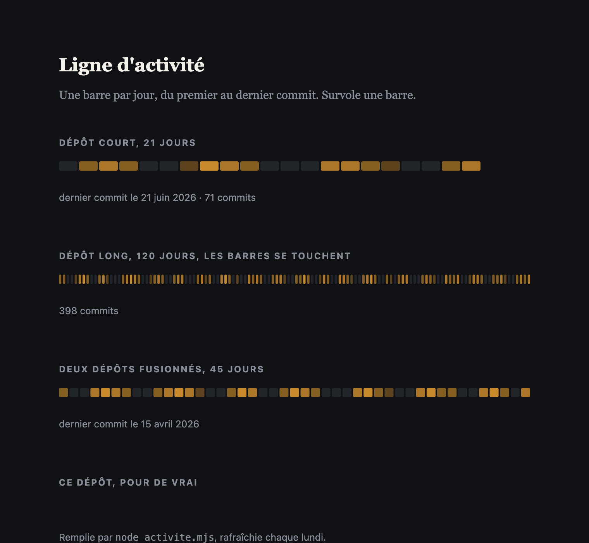

# Ligne d'activité

Une barre par jour, du premier au dernier commit, en pied de page. Se remplit seule
chaque lundi depuis les dépôts GitHub que tu déclares.



Pas un calendrier de contributions : une ligne. La longueur dit la durée, la couleur dit
l'intensité, rien d'autre n'est affiché.

## Poser

```html
<link rel="stylesheet" href="ligne-activite.css">

<figure class="activite" data-cible="site"></figure>

<script src="ligne-activite.js" defer></script>
```

Deux jetons CSS suffisent à l'accorder :

```css
.activite { --activite-teinte: #4ba36b; --activite-creux: #8a8f99; }
```

## Remplir

`activite.config.json` :

```json
{
  "cibles": {
    "site": {
      "fichier": "index.html",
      "marque": "site",
      "depots": ["toi/ton-site", "toi/ton-api"]
    }
  }
}
```

Plusieurs dépôts sont fusionnés par jour. Puis :

```bash
node activite.mjs           # depuis GitHub
node activite.mjs --local   # depuis des dossiers locaux, sans réseau
```

Le script écrit `data-debut` et `data-jours` dans la figure, et remplit
`<span class="activite-dernier">` et `<span class="activite-total">` s'ils existent.
Ne jamais éditer ces valeurs à la main.

## Rafraîchir tout seul

`.github/workflows/activite.yml` relit les dépôts chaque lundi et pousse si ça a bougé.
Pour lire des dépôts privés, pose un secret `ACTIVITE_TOKEN` : un jeton fine-grained,
`Contents` en lecture seule.

```bash
gh secret set ACTIVITE_TOKEN --repo toi/ton-site
```

Le jeton passe à git par la configuration, jamais sur une ligne de commande, et il est
masqué dans les messages d'erreur.

## Détails qui comptent

- Une barre fait au plus 24 px, au moins 3 px avec 2 px d'écart. En dessous elles se
  touchent, avec 0,3 px de chevauchement pour éviter les fils clairs.
- Paliers : 0 ; 1 ; 2 à 5 ; 6 à 11 ; 12 et plus.
- Du premier au dernier commit, pas jusqu'à aujourd'hui : un dépôt arrêté montre sa
  durée, pas son abandon.
- La date d'auteur (`%as`), pas celle du commit : le jour où tu as travaillé.
- Clone `--bare --filter=blob:none` : l'historique seul, aucun fichier téléchargé.
- Allumage de gauche à droite à l'entrée à l'écran. Rien en `prefers-reduced-motion`,
  pas de survol en tactile.
- Si un dépôt est injoignable, le script sort en erreur : une ligne ne se rafraîchit
  jamais à moitié.

Aucune dépendance, ni au build ni au runtime. Node 18+.

## Voir

`demo/index.html`, en ouvrant le fichier directement.

MIT.
